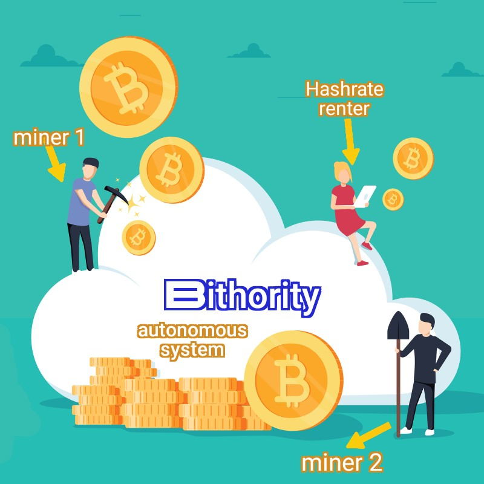
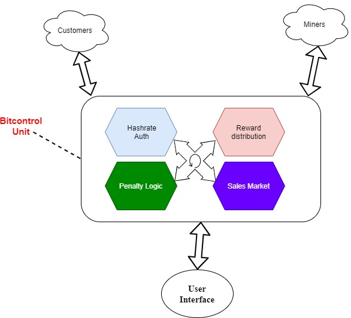

# Bithority

## Bitcoin Mining Control Authority 
(There is no code yet! Still in proof of concept phase) 

# What is Bithority?

Bithority or Bitcoin mining control authority is a protocol/network based on the concept to provide a trustless platform for renting Bitcoin hashrate to any-scale investors! The Bithority project aims to vastly decentralize the Bitcoin mining ecosystem.
**(Dev team available on Discord: https://discord.gg/us7YA5CdTG )**

## Problem Definition
**Puzzle:** Assume a Bitcoin miner that generates Bitcoin to store/sell it and making profit...Recently He is in urgent need of cash not only to pay for its expenses but also to expand its facilities. But he does not want to sell any of his precious coins and wants to hodl it!.. What should he does to provide the urgent cash?! 🤔

**💡Solution 1:** He can escrow his Bitcoins to take a loan in Usd.. 

**Defect of solution 1:** He can only take a loan in limited margin, for instance, 30-50% of his Bitcoins

So what you think? **What could be an ideal solution** to take a larger cash without losing his mined Bitcoins?!  
 
**The ideal Solution:** Bithority  😎

The Bitcoin mining ecosystem is becoming bigger and bigger day by day and those who have access to special resources and facilities (suitable for mining) can only decide to establish mining farms and participate in securing the Bitcoin network. This needs to be changed, so that also retail investors can participate and grab some pieces of this Bitcoin mining cake! However, this participation of retail investors should be in a way that makes a bilateral dependency between miners and retail investors so that the mining force gets practically distributed among all folks. (Only selling hash-rate from big farmers to investors cannot make that dependency and entanglement between retailers and miners!) 

Building a mining farm currently takes a considerable amount of capital and financial capacity and requires capable miners to deal with challenging technical issues such as supplying cheap energy sources, efficient mining machines, electrical infrastructures, cooling systems, adapting to regional jurisdictions, risk control strategies, cash flow control and professional budgeting plans. Therefore, we see a totally different shape of mining in line with the early days of Bitcoin when Bitcoin was still minted profitably with home-scale systems and a low budget!

As such, legit concerns have been raised and arguments circulating around centralization of Bitcoin mining... mining in the hands of only those very rich individuals/corporations that have special facilities. We seriously think this is a true concern and needs to be addressed by dedicated Bitcoin community players in order to protect and keep the decentralized essence of Bitcoin network the way it was envisioned by Satoshi Nakamoto, set out in its whitepaper!

In this regard, the Bithority idea was emerged to topple this very concern.

## Bithority Solution

Bithority uses smart contracts on the Stacks blockchain to raise funds for mining operations from investors. New miners can raise capital for buying ASICs and developing their operation, while investors get a share of the hash power that the miners create.
Therefore, Bithority practically act as a Bitcoin hashrate rental service that benefits both miners and investors by sharing in the Bitcoin mining economy and and a share of its profitability cake! 

https://github.com/labs3/bithority/blob/main/Drawings/Bithority_158.jpg

As such, any miner around the world, no matter where, that has enough facilities to plug in a mining farm can then connect it to Bithority protocol and rent his hashrate. No need of any reputation or credential, KYC, bureacracy, jurisdictional compliance and no need of nothing except pluging his farm into Bithority! 
On the other side, any-scale investors (from very small to very big ones), can join the Bithority platform to select their favorite miner and appropriate hashrate to invest their preferred amount to participate in Bitcoin mining anywhere in the world!

*add more here guys lol*

## Bithority Structure 
Since Bithority is a trustless autonomous protocol then it needs to automatically interact with all parties participating in the system. In one side, we have miners that they escrow enough Bitcoin proportional to 
Their selling hashrate amount and on the other side we have investors that pay Btc for their requested renting hashrate. Therefore, after the execution of the deal between a spotted miner and invetsor, the miner is committed to pay the mining reward (accossiated with defined user) into the Bithority reward pool in a specified time (that is already set in the sale market upon agreement). 

https://github.com/labs3/bithority/blob/main/Drawings/IMG-20210323-WA0000.jpg

Dgshhdhdhhdh...... 
.gif) 

## Potential Market and Users

According to Ycharts.com, Bitcoin Miners Revenue Per Day is at a current level of 31.68M$ in June 2021. This is a 220.9% rise from one year ago. That comes down to approx. 1 Billion$ monthly and 11 Billion$ yearly! These are only the estimates for this year and the  predicts further increases in Bitcoin valuation. And as such, more and more miners will start mining in the following years to take a piece of cake! 
Assuming only 10% of this revenue gets back to _Bitcoin farm owners_ and invested in development of their facility, then approximately 1.1 Billion$ could enter the Bithority ecosystem! Bithority platform could be an efficient and trusted tool for _mining farm owners_ to take loans based on their hashrate collateralization.
 
  ![]        ☝️Figure: Any-scale investor can participate in Bithority. 

## Can I contribute?
Yes, you can join us in our Discord server (https://discord.gg/us7YA5CdTG) and also read the guides about Bithority's structure.

